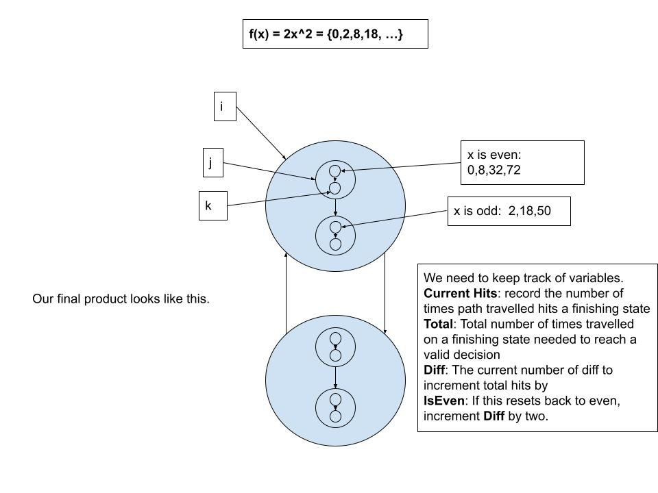
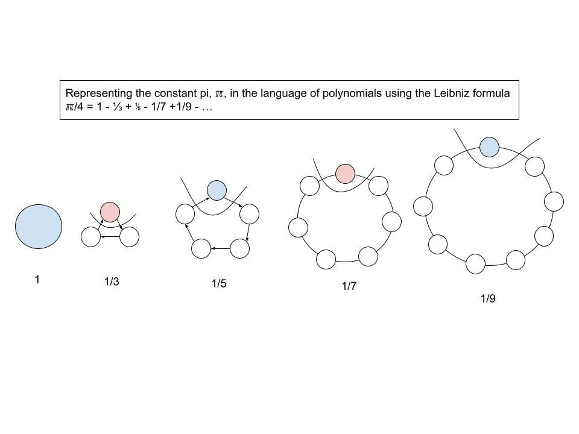
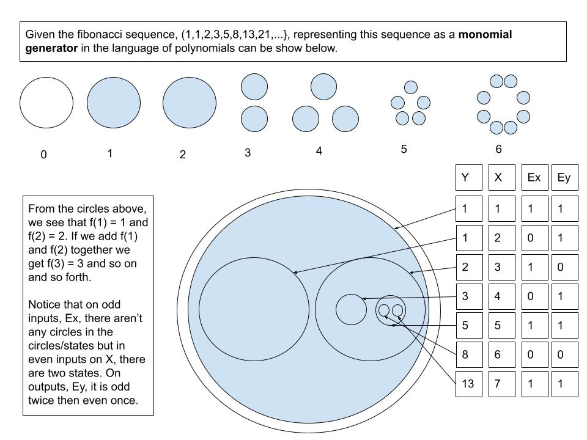
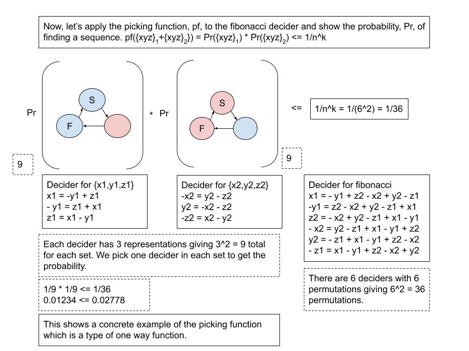

# Applications of Monomial Deciders

This is part 2 of the article, "[A Language of Polynomials](https://github.com/ericung/languageofpolynomials)", with concrete some examples of how to use it including constructing the one way function using the picking function.

## 1. Starting With A Theorem Of Infiniteness


## 2. Mapping Out Worlds


## 3. Euler's Constant


## 4. Sketching Into Code


```cs
bool generalizedMD(int y)
{
    if (y == 0)
    {
        return true;
    }
    var s = y;
    while (s >= 0)
    {
        for (int i = 0; i < 2; i++)
        {
            for (int j = 0; j < 4; j++)
            {
                if (s == 0 && (j == 0 || j == 2) && i == 0)
                {
                    return true;
                }
                else if (s < 0)
                {
                    return false;
                }
                s -= 1;
            }
        }
    }
    return true;
}
```

## 5. Gather Some Data


```cs
// Generates negatives from a general monomial decider represented as an algorithm so
// that we can collect data about the negatives
int[] Generator(int max)
{
    int[] result = new int[max + 1];
    int x = 0;
    int negatives = 0;
    int i = 0;
    while (x < max + 1)
    {
        int num = 2 * (Convert.ToInt32(Math.Pow(x, 2)));
        if (generalizedMD(i))
        {
            // A simple verifier
            if (num == i)
            {
                Console.WriteLine(negatives);
                Console.WriteLine("f(" + x + ") = " + i);
                result[x] = i;

                x++;
                negatives = 0;
            }
            else
            {
                negatives++;
            }
        }
        i++;
    }

    return result;
}
```

[Logs for the curious.](Source/ApplicationsForMonomialDeciders/Logs/MDxx/generalizedMD.txt)

## 6. Representing Monomial Deciders As Code


```cs
// After getting some log results, we can construct a decider
bool MonomialDecider2xx(int y)
{
    var total = 0;
    var hits = 0;
    var diff = 1;
    var isEven = 0;
    var s = 0;

    while (s <= y)
    {
        for (int i = 0; i < 2; i++)
        {
            for (int j = 0; j < 2; j++)
            {
                for (int k = 0; k < 2; k++)
                {
                    if ((i == 0)&&(j == 0 || j == 1)&&(k == 0))
                    {
                        if (hits == total)
                        {
                            if (s == y)
                            {
                                Console.WriteLine(s + ": Hits: " + total);
                                return true;
                            }
                            else if (s > y)
                            {
                                return false;
                            }

                            total += diff;
                            isEven++;
                            if (isEven % 3 == 2)
                            {
                                isEven = 0;
                                diff += 2;
                            }
                        }

                        hits++;
                    }
                    s++;
                }
            }
        }
    }

    return false;
}
```

[Logs for the curious.](Source/ApplicationsForMonomialDeciders/Logs/MDxx/md2xx.txt)

## 7. Negative Numbers


## 8. Pi



## 9. Fibonacci



Let's take apart the fibonacci sequence and try to find some patterns.

```cs
int fibonacci(int n)
{
    if (n == 0)
    {
        return 0;
    }

    int y = 1;
    int y1 = 1;
    int y2 = 0;

    for(int i = 1; i < n; i++)
    {
        y = y1 + y2;
        y2 = y1;
        y1 = y;
    }

    return y;
}
```

Here's the log for the first 14 entries.

```
f(	0	) =		0		Ex = 0		eY = 0
f(	1	) =		1		Ex = 1		eY = 1
f(	2	) =		1		Ex = 0		eY = 1
f(	3	) =		2		Ex = 1		eY = 0
f(	4	) =		3		Ex = 0		eY = 1
f(	5	) =		5		Ex = 1		eY = 1
f(	6	) =		8		Ex = 0		eY = 0
f(	7	) =		13		Ex = 1		eY = 1
f(	8	) =		21		Ex = 0		eY = 1
f(	9	) =		34		Ex = 1		eY = 0
f(	10	) =		55		Ex = 0		eY = 1
f(	11	) =		89		Ex = 1		eY = 1
f(	12	) =		144		Ex = 0		eY = 0
f(	13	) =		233		Ex = 1		eY = 1
f(	14	) =		377		Ex = 0		eY = 1
```

[Logs for the curious.](Source/ApplicationsForMonomialDeciders/Logs/Fibonacci/fibonacci.txt)

## 10. Analysis Of Parity In Fibonacci


## 11. Redrawing the Fibonacci Sequence


Fibonacci generator with the set of generator functions.

```cs
int fibonacciGenerator(int n)
{
    int stateX = 0;
    int stateY = 1;
    int stateZ = 1;
    int cycles = 0;

    while (cycles <= n)
    {
        cycles++;

        if (cycles > n)
        {
            return stateX;
        }

        stateX = stateY + stateZ;
        Console.WriteLine("stateX: " + stateX + "\tstateY: " + stateY + "\tstateZ: " + stateY);
        
        cycles++;

        if (cycles > n)
        {
            return stateY;
        }

        stateY = stateX + stateZ;
        Console.WriteLine("stateX: " + stateX + "\tstateY: " + stateY + "\tstateZ: " + stateY);

        cycles++;

        if (cycles > n)
        {
            return stateZ;
        }

        stateZ = stateX + stateY;
        Console.WriteLine("stateX: " + stateX + "\tstateY: " + stateY + "\tstateZ: " + stateY);
    }

    return stateX;
}
```

[Logs for the curious.](Source/ApplicationsForMonomialDeciders/Logs/Fibonacci/fibonacciGenerator.txt)

## 12. The Fibonacci Decider


Given a sequence of length six, we can decide if it forms a valid fibonacci sequence.\
The following is a log of calculations.

```

x1 = 144, y1 = 89, z1 = 55, x2 = 34, y2 = 21, z2 = 13

144 = 89 - 13 + 34 - 21 + 55 = 144
89 = 13 - 34 + 21 - 55 + 144 = 89
13 = 34 - 21 + 55 - 144 + 89 = 13
34 = 21 - 55 + 144 - 89 + 13 = 34
21 = 55 - 144 + 89 - 13 + 34 = 21
55 = 144 - 89 + 13 - 34 + 21 = 55

```

# 13. The Fibonacci Picking Function



-----

## References

Ung, E. (2023). [A Language of Polynomials](https://github.com/ericung/languageofpolynomials) (Version 1.0.0). https://github.com/ericung/languageofpolynomials

Hamming, R. W. (1986). *Numerical methods for scientists and engineers.* Courier Corporation.

Ung, E. (2023). [Inferring Lindenmayer Systems](https://github.com/ericung/InferrenceSystems/blob/master/Resources/lindenmayer_systems.pdf). 1(1), 1–6. https://github.com/ericung/InferrenceSystems/blob/master/Resources/lindenmayer_systems.pdf
