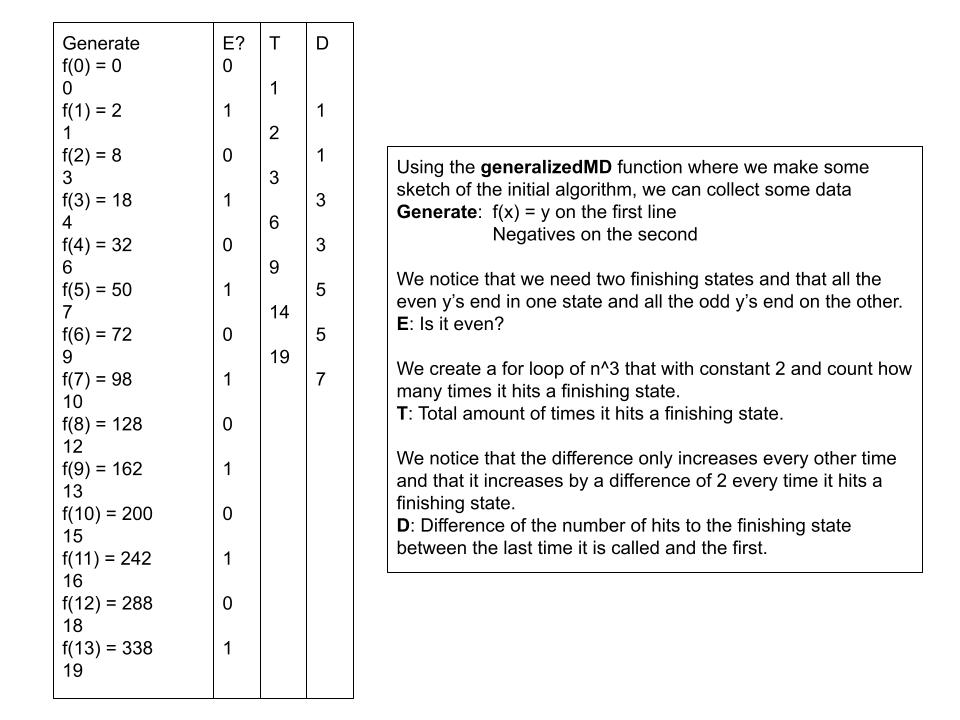

# Applications of Monomial Deciders

This is an etension of the article, "A Language Of Polynomials", with examples of how to use it.

## 1. Starting With A Theorem Of Infiniteness


## 2. Mapping Out Worlds


## 3. Euler's Constant


## 4. Sketching Into Code


```cs
bool generalizedMD(int y)
{
    if (y == 0)
    {
        return true;
    }
    var s = y;
    while (s >= 0)
    {
        for (int i = 0; i < 2; i++)
        {
            for (int j = 0; j < 4; j++)
            {
                if (s == 0 && (j == 0 || j == 2) && i == 0)
                {
                    return true;
                }
                else if (s < 0)
                {
                    return false;
                }
                s -= 1;
            }
        }
    }
    return true;
}
```

## 5. Gather Some Data


```cs
// Generates negatives from a general monomial decider represented as an algorithm so
// that we can collect data about the negatives
int[] Generator(int max)
{
    int[] result = new int[max + 1];
    int x = 0;
    int negatives = 0;
    int i = 0;
    while (x < max + 1)
    {
        int num = 2 * (Convert.ToInt32(Math.Pow(x, 2)));
        if (generalizedMD(i))
        {
            // A simple verifier
            if (num == i)
            {
                Console.WriteLine(negatives);
                Console.WriteLine("f(" + x + ") = " + i);
                result[x] = i;

                x++;
                negatives = 0;
            }
            else
            {
                negatives++;
            }
        }
        i++;
    }

    return result;
}
```

## 6. Representing Monomial Deciders As Code


```cs
// After getting some log results, we can construct a decider
bool MonomialDecider2xx(int y)
{
    var total = 0;
    var hits = 0;
    var diff = 1;
    var isEven = 0;
    var s = 0;

    while (s <= y)
    {
        for (int i = 0; i < 2; i++)
        {
            for (int j = 0; j < 2; j++)
            {
                for (int k = 0; k < 2; k++)
                {
                    if ((i == 0)&&(j == 0 || j == 1)&&(k == 0))
                    {
                        if (hits == total)
                        {
                            if (s == y)
                            {
                                Console.WriteLine(s + ": Hits: " + total);
                                return true;
                            }
                            else if (s > y)
                            {
                                return false;
                            }

                            total += diff;
                            isEven++;
                            if (isEven % 3 == 2)
                            {
                                isEven = 0;
                                diff += 2;
                            }
                        }

                        hits++;
                    }
                    s++;
                }
            }
        }
    }

    return false;
}
```

## 7. Negative Numbers


## 88. Pi


-----

## References

Ung, E. (2023). [A Language of Polynomials](https://github.com/ericung/languageofpolynomials) (Version 1.0.0). https://github.com/ericung/languageofpolynomials
