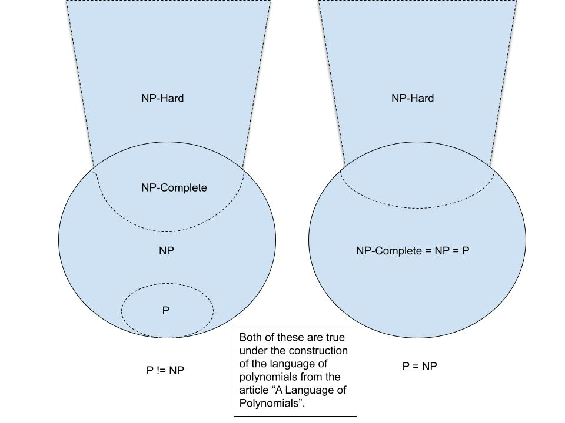
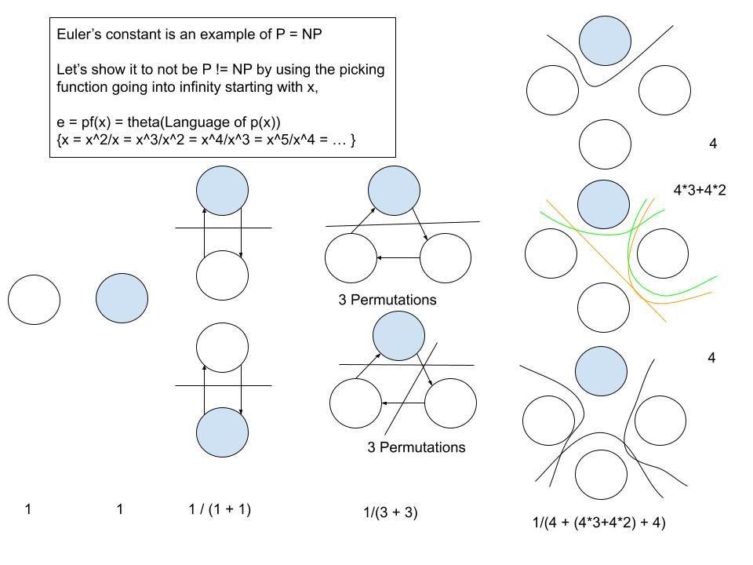

# Applications of Monomial Deciders

This is an etension of the article, "A Language Of Polynomials", with examples of how to use it.

## Starting With A Theorem Of Infiniteness

## Mapping Out Worlds

## Euler's Constant

----

## WIP

-----

## References

Ung, E. (2023). [A Language of Polynomials](https://github.com/ericung/languageofpolynomials) (Version 1.0.0). https://github.com/ericung/languageofpolynomials
